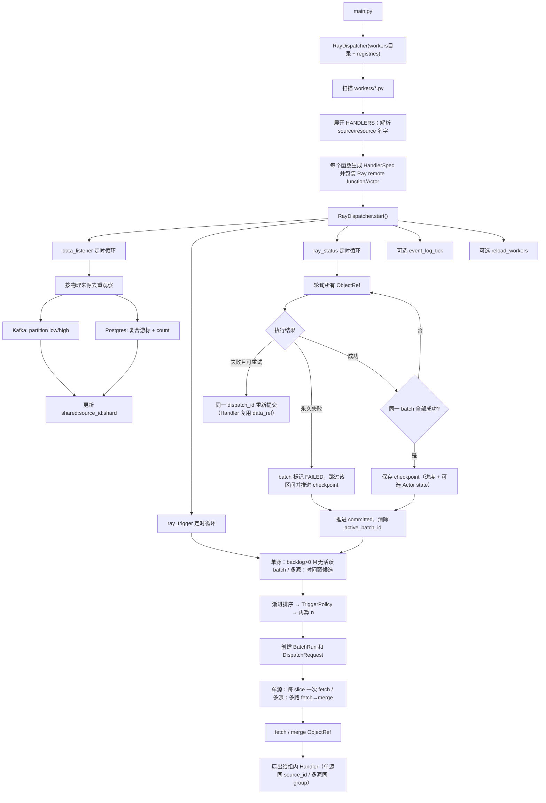

# RayDispatcher 当前代码流程

## 总流程



## 1. Worker 扫描

入口：`RayDispatcher(workers_dir_or_specs, source_registry=..., resource_registry=..., payload_reader=...)`。
传入目录路径时内部调用 `discover_workers()`（见 `ray_dispatcher/discovery.py`）。

1. 若构造参数是目录路径，调用 `discover_workers(directory, source_registry=..., resource_registry=...)`。
2. 扫描目录下所有非下划线开头的 `*.py` 并导入（顶层代码会执行，目录必须可信）。
3. 收集各模块 `SOURCES` / `RESOURCES`（纯配置 mapping），与可选注入 registry 合并：同名且规范化配置不等价则失败，等价则保留一份。
4. 模块可导出 `HANDLERS`；无 `HANDLERS` 或空列表则跳过该文件的 Handler 展开（仍合并其
   `SOURCES` / `RESOURCES`）。每项通常只需 `entrypoint`（默认 ID 为
   `{module}:{entrypoint}`，可用 `handler_id` 覆盖）。不再支持 `WORKER_CONFIG` /
   `WORKER_SPEC` / `get_worker_spec`。整目录至少一个 Handler，否则报错。
5. `sources` / `resources` 为合并后注册表中的名字；禁止 HANDLERS 内联 source mapping。
   - **Source**：随时间增量变化、由 Dispatcher 追进度（checkpoint / 窗口）。
   - **Resource**：快照旁路依赖（放进 `RESOURCES` 即快照语义）。`static` 仅小配置；大维表用 `file`；也可用 `postgres`（`query` 或 `table` + `key_column` + `dsn`）。合并完成后由 Dispatcher 在 `start()` 前统一 `ResourceLoader.preload()`；submit 热路径只读 cache。
6. `output` 为可选透传 mapping，进入瘦 `HandlerRequest.output`；框架不解释。面向目录投放时，业务依赖宜函数内 import，写出路径走 `output`。
7. 普通函数通过 `ray.remote(max_retries=0)` 包装；Actor 类通过 `ray.remote(max_restarts=0)` 包装。
8. 返回 `(handlers, source_registry, resource_registry)`；目录启动时 Dispatcher 用合并结果重建 `ResourceLoader`，并在进入调度循环前 preload 全部资源。
9. 所有 Handler 走 fetch→fanout；相同 `source_id` 自动共用一个 source checkpoint 与一次区间读取。

Handler 收到的是瘦 `HandlerRequest`（`dispatch_id` / `handler_id` / `output`；Actor 在
（重新）创建后的首次 submit 可有 `checkpoint_state`）；调度区间留在 `DispatchRequest` 供
fetch/内部使用，数据经 `records` 传入。

## 2. 启动循环

`start()` 先 `ResourceLoader.preload()`，再创建 asyncio Task：

| 循环 | 默认周期 | 单次执行函数 | 备注 |
|---|---:|---|---|
| 数据观察 | 5 秒 | `data_listener()` | 始终开启 |
| 调度触发 | 1 秒 | `ray_trigger()` | 始终开启 |
| Ray 状态 | 1 秒 | `ray_status()` | 始终开启 |
| 事件快照 | 5 秒 | `event_log_tick()` | `event_log_interval<=0` 关闭 |
| workers 热加载 | 关闭 | `reload_workers()` | 仅目录模式且 `reload_interval>0` |

各循环独立定时，但读写 DispatcherState 时使用同一个 `asyncio.Lock`。

## 3. data_listener

`data_listener()` 先按 brokers/topic 或 DSN/table 对物理来源去重，再按 `source_id` 更新共享状态。
远程观察（水位 / checkpoint load-save / Postgres count / 多源 event-time）在 **`_lock` 外** 执行，
多个物理源用 `asyncio.gather` 并行；拿到结果后只短持锁合并进 `DispatcherState`。

```text
group handlers by physical source
gather observe IO outside lock
short lock: merge shared:{source_id}:{shard} state
```

### Kafka

1. `SourceObserver.kafka_watermarks(source)` 根据该 source 的 brokers 获取/创建 Consumer。
2. 调用 `list_topics(topic)` 获取全部分区。
3. 每个分区调用 `get_watermark_offsets(..., cached=False)`，得到 `(low, high)`。
4. 状态键为：

```text
shared:{source_id}:{partition}
```

5. 第一次观察时加载 checkpoint：
   - 有 checkpoint：使用 checkpoint；
   - `initial_offset=earliest`：使用 low；
   - `initial_offset=latest`：使用当前 high。
6. 计算：

```text
backlog = high - committed
```

7. 更新 `observed`、`backlog`、EWMA `arrival_rate`。
8. 如果 checkpoint 落在 Kafka retention 范围外，根据配置报错或重置到 low。

Kafka metadata Consumer 按 `brokers` 缓存，并用可重入锁串行
`list_topics` / watermark / `offsets_for_times` 等调用（`asyncio.to_thread` 并发时也不共用
裸 Consumer）。不同地址可并存；相同物理 topic 每个监听周期只查询一次，再共享 observed 水位。

### Postgres

1. 根据 source.dsn 获取/创建 asyncpg Pool；不同 DSN 对应不同 Pool。
2. 查询：

```sql
SELECT updated_at, id
FROM schema.table
ORDER BY updated_at DESC, id DESC
LIMIT 1;
```

3. 得到当前稳定上界 `(updated_at, primary_key)`。
4. 从 checkpoint 到当前上界查询 count：

```sql
WHERE (updated_at, id) > (start_timestamp, start_id)
  AND (updated_at, id) <= (end_timestamp, end_id)
```

5. 状态键为：

```text
shared:{source_id}:{table}
```

6. 更新 `observed`、`backlog=count` 和 `arrival_rate`。

## 4. ray_trigger

1. 统计当前全局 `SUBMITTED/RUNNING` task 数。
2. 获取 `ray.available_resources()['CPU']`。
3. 筛选候选来源：

```text
backlog > 0
active_batch_id is None
retention_gap is None
```

4. 调度优先级为渐进字典序（容量检查在排序之后单独做）：
   - Handler 静态 priority；
   - backlog 最大者优先；
   - 最慢者优先（backlog / processing_rate 最大）；
   - 等待时间最长者优先。
5. task 数约束（单源每波最多 1 个 fetch；容量不够则为 0）：

```text
wave = 1 if free_slots / (1+N) and CPUs allow else 0
backlog >= batch_window.min_items
take = backlog if max_items is None else min(backlog, max_items)
```

同 `source_id` 的 Handler 中，一波预留 `1 个 fetch + N 个 Handler` in-flight slot。组内
`batch_size` 区间取最严：`min_items = max(各 min)`，`max_items = min(各有限 max)`。

`batch_size` 语义：`n` / `(n, None)` → `[n,]`；`(None, n)` → `[,n]`；`(n, m)` → `[n, m]`。
Dispatcher 不按 batch_size 切多片；需要再分片在 Handler 内处理。

排序之后，`TriggerPolicy`（主系统注入；默认 `HasBacklog → SourceIdle → HasCapacity`；多源另含
`HasTimeWindow`）评估每个候选，输出 `TRIGGER | DEGRADE | SKIP | BLOCK`，并写入
`trigger_evaluated` 事件。条件还可附带 `SoftAction`（`NONE` / `URGENT` / `THROTTLE` /
`ALERT_ONLY`）：当决策为 `DEGRADE` 且 soft 为 `THROTTLE` 时，按 `concurrency_factor` 缩小本轮
task 数 `n`。Handler / HANDLERS 不配置触发策略。

### 多源 Kafka 时间窗

`sources` 长度 ≥ 2 且全为 Kafka 时：

1. `data_listener` 观察各源 partition watermark，并用消息 timestamp 得到各源 event-time 高水位；组级 `T_right = min(各源)`。
2. 组级 checkpoint key：`mswin:ms:{id1}+{id2}+...`（配置中的 source 顺序）。
3. 窗口 `[T_left, min(T_right, T_left + DispatcherConfig.max_window_seconds))`；空窗不调度（`HasTimeWindow`）。
4. `offsets_for_times` 映射各源各分区的 start/end offset。某分区缺少时间戳对应 offset 时，
   **回退到该分区 high**（得到空区间），不得回退到 low，以免静默回放/补拉。
5. 多路 `submit_fetch` → `submit_merge` 得到 `dict[source_id, list]` → 每个 Handler 调用一次。
6. 全成功后同时推进组级时间与各 `shared:{source_id}:{partition}` offset；失败整窗跳过，禁止半源提交。

每个 Actor Handler 只创建并复用一个 Actor；后续 method 调用不会再次按空闲 CPU 拦截。

## 5. 区间拆分与 Ray 提交

### Kafka

Kafka 使用半开区间。每轮对每个 source shard 最多提交 **一个** fetch：
`[committed, committed+take)`（`take` 由 `batch_size` 区间的 max 决定；`None` 则吃到
observed）。剩余 backlog 进入下一轮。例如 `batch_size=(None, 10)` 且 backlog=25：

```text
[100, 125), max=10
-> [100, 110)   # 本波
# 余 [110, 125) 下轮
```

整数 `batch_size=10` 等价 `[10,]`：backlog>=10 后一次取全部，例如 backlog=25 → `[100, 125)`。

每个 `DispatchRequest`（fetch/merge/内部）主要字段：

```text
dispatch_id
worker_name          # handler_id 为其同义 property
source_id
source_kind
topic / partition / start_offset / end_offset   # Kafka
table / start_cursor / end_cursor               # Postgres
window_start / window_end / source_ids          # 多源时间窗
task_index
task_count / n
```
可选的 `output`（mapping）进入瘦 `HandlerRequest.output`，供写出侧使用；框架不解释。
Handler 业务应使用 `dispatch_id`、`handler_id`、`output`（及可选 `checkpoint_state`）与
`records`；Task 可选 `resources`（共享 ObjectRef），Actor 从构造注入的实例字段读维表。
offset/window 只在 fetch 用的 `DispatchRequest` 上。

### 共享 fetch 扇出

每个 slice 先提交一次 `PayloadReader.fetch(request, source)`（经 `submit_fetch`）。fetch 成功后，
原始 ObjectRef 作为顶层第二参数提交给每个 `handler(request, records)`；若 Handler 声明了
`resources`：Task 模式对 `load_many` 结果 `ray.put` 一次并以共享 ObjectRef 作为第三参数；
Actor 模式仅在构造 `Actor.remote(resources)` 时注入，`process` 不再传 resources。
Ray 负责解析顶层 ObjectRef 依赖，多个同 `source_id` 的 Handler 不再重复读取 Kafka。
Handler 自动重试继续复用该 fetch ObjectRef。只有所有 fetch 和所有
Handler 都成功，共享 checkpoint 才推进。

### Postgres

固定的 `SourceObserver` 在数据库内按 `(timestamp, primary_key)` 排序，取得本批上限行数的
边界，并返回**单一**复合游标范围（`postgres_ranges(..., max_ranges=1, batch_size=take)`）。
不使用跨进程不稳定的 Python `hash()`。

### 状态写入

提交后保存：

```text
state.batches[batch_id] = BatchRun
state.runs[dispatch_id] = TaskRun(ref=ObjectRef)
state.sources[shared_source_key].active_batch_id = batch_id
```

## 6. ray_status

1. 找出所有 `SUBMITTED/RUNNING` 的 ObjectRef。
2. 调用 `ray.wait(ObjectRefs, timeout=0)` 非阻塞取得原始 ObjectRef；不使用会返回包装 Task 的
   `asyncio.wait()`。
3. fetch 成功：保留原始 ObjectRef 并扇出下游；Handler 成功：TaskRun 变为 `SUCCEEDED`。
4. 失败：
   - fetch：`attempt <= fetch_max_retries` 时用同一个 `DispatchRequest` / `dispatch_id` 重提；
   - Handler：`attempt <= max_retries` 时用同一个 `HandlerRequest` / `dispatch_id` 重提，并复用原
     fetch `data_ref`（不再读源）；
   - 超过次数：TaskRun 变为 `FAILED`；同批全部终态且存在失败时进入 skip 路径。
5. 同一个 batch 的所有 task 成功后进入 commit 路径。
6. commit / skip 为两阶段（避免落盘 IO 长时间持锁）：
   - 短锁：校验 `active_batch_id` / `committed == batch.start`，将 batch 标为
     `COMMITTING` 或 `SKIPPING`，收集 checkpoint writes（skip 另收集 failure 元数据与 fetch refs）；
   - 锁外：`FailureStore.save_failure`（尽量物化 fetch payload）与 `checkpoint_store.save_many`；
   - 短锁：再次校验后推进 `committed`、清除 `active_batch_id`、释放 ObjectRef、发事件。
   - 落盘失败时 batch 回到 `RUNNING`，下轮 status 重试；来源在此期间仍被 `active_batch_id` 挡住。
7. 成功时：

```text
source.committed = batch.end
source.active_batch_id = None
source.processing_rate = EWMA(本批处理速度)
batch.status = SUCCEEDED
```

永久失败 skip 同样推进 committed 到 batch.end 并清除 `active_batch_id`
（`batch.status = FAILED`，不更新 processing_rate）。失败详情留在 FailureStore。毒区间 skip
只推进进度，不改 Actor `checkpoint_state`。

8. checkpoint 持久化成功后清除本批 `ref/data_ref`，释放 Ray Object Store 数据。

## 7. 内部状态

```text
DispatcherState
├── sources  # 每个 shared:source_id:shard 的水位、backlog、速率
├── multisource_windows  # 多源组级时间窗
├── batches  # 一批区间的整体状态
├── runs     # 每个 fetch / Handler Ray task/Actor method 的 ref、attempt、结果、错误
└── loop_errors

CheckpointStore（构造注入）
├── shared:… / mswin:…     # CheckpointDocument(progress, state=None)
└── actor:{handler}:{key}  # progress + 不透明 state；批成功时与进度 save_many

FailureStore（构造注入，默认 MemoryFailureStore）
└── 永久失败批次的区间、错误摘要、可物化的 payload
```

`await snapshot()` 在调度锁下返回适合日志/监控的序列化视图；运行中的 Ray ObjectRef 在
`state.runs[*].ref`。目录模式可设 `reload_interval`：指纹包含 HANDLERS/SOURCES/RESOURCES 规范化
配置以及 workers 目录下 `*.py` 的 `(相对路径, mtime_ns, size)`，因此仅改函数体也会触发重载；
有 in-flight batch 时推迟切换。

## 8. 当前实现边界

1. 热加载已实现（`reload_workers` / `reload_interval`）；有 in-flight 时不切换，preload 失败则保留旧配置。
2. data_listener、ray_trigger、ray_status 使用同一个状态锁。`data_listener` 的远程观察 IO，以及
   `ray_status` 的 checkpoint / failure 落盘，已在锁外执行（batch 经 `COMMITTING`/`SKIPPING` 中间态）。
   `ray_trigger` 的切分查询（`postgres_ranges` / `offsets_for_times`）仍可能在持锁期间 await。
3. 示例提供 SQLiteCheckpointStore 跨进程持久化；多 Dispatcher 实例仍需共享数据库和单写者/CAS。
4. 当前保证 at-least-once；Kafka `records` 只含 message value。框架 `KafkaPayloadReader` 若在
   读满 `[start, end)` 前遇到 partition EOF 会失败，不会静默提交不完整区间。下游幂等由业务唯一键负责，
   可用 `dispatch_id` 做批次追踪；调度用的 partition/offset 留在 Dispatcher checkpoint。
5. 为判断 fetch 是否成功，当前状态轮询会短暂解析已完成 fetch 的结果，但不会把 payload 保存在历史
   state 中；大批量数据仍应控制 `batch_size` 上限（或 Handler 内再分片），并配置 Ray object spilling。
