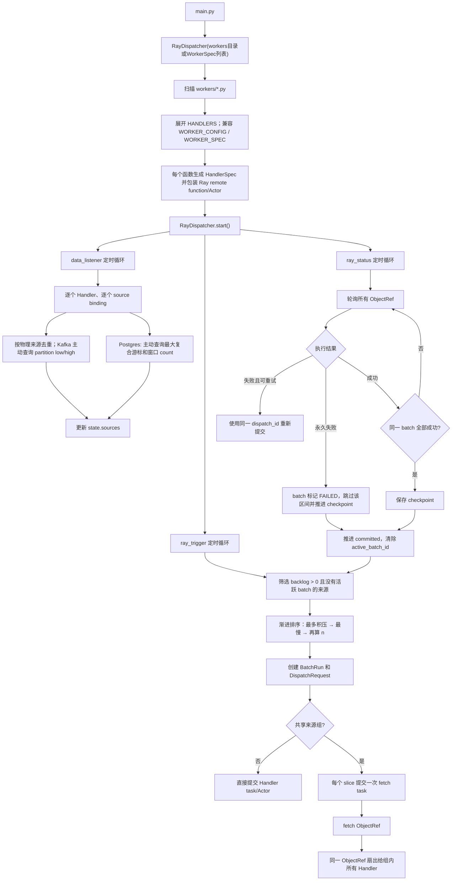

# RayDispatcher 当前代码流程

## 总流程



## 1. Worker 扫描

入口：`RayDispatcher(workers_dir_or_specs, ...)`。传入目录路径时内部调用
`discover_workers()`（见 `ray_dispatcher/discovery.py`）。

1. 若构造参数是目录路径，调用 `discover_workers(directory)`（也可使用语义别名 `discover_handlers`）。
2. 扫描目录下所有非下划线开头的 `*.py`。
3. 导入模块。导入会执行模块顶层代码，因此 workers 目录必须可信。
4. 优先展开模块的 `HANDLERS`；每一项代表一个独立调度函数。旧的 `get_worker_spec()`、`WORKER_SPEC`、`WORKER_CONFIG` 兼容为单 Handler。
5. 将每个函数的来源转换成 `KafkaSource`/`PostgresSource`，输出转换成 `OutputSpec`。
6. 普通函数通过 `ray.remote(max_retries=0)` 包装；Actor 类通过 `ray.remote(max_restarts=0)` 包装。
7. 普通 Handler 拥有独立 checkpoint；配置相同 `shared_source_group`、`data_fetcher` 和
   `fetcher_id` 的 Handler 共同使用一个 source checkpoint，并共享一次区间读取。

## 2. 启动三个循环

`start()` 创建三个 asyncio Task：

| 循环 | 默认周期 | 单次执行函数 |
|---|---:|---|
| 数据观察 | 5 秒 | `data_listener()` |
| 调度触发 | 1 秒 | `ray_trigger()` |
| Ray 状态 | 1 秒 | `ray_status()` |

三个循环独立定时，但读写 DispatcherState 时使用同一个 `asyncio.Lock`。

## 3. data_listener

`data_listener()` 先按 brokers/topic 或 DSN/table 对物理来源去重，再把一次观察结果分发给所有 Handler：

```text
group handlers by physical source
for physical source:
    observe once
    for independent handler:
        calculate backlog from handler checkpoint
    for shared_source_group:
        calculate backlog once from group checkpoint
```

### Kafka

1. `SourceObserver.kafka_watermarks(source)` 根据该 source 的 brokers 获取/创建 Consumer。
2. 调用 `list_topics(topic)` 获取全部分区。
3. 每个分区调用 `get_watermark_offsets(..., cached=False)`，得到 `(low, high)`。
4. 状态键为：

```text
handler_id:source_id:partition
```

共享来源组改用：

```text
shared:shared_source_group:source_id:partition
```

5. 第一次观察时加载 checkpoint：
   - 有 checkpoint：使用 checkpoint；
   - `initial_offset=earliest`：使用 low；
   - `initial_offset=latest`：使用当前 high。
6. 计算：

```text
backlog = high - committed
```

7. 更新 `observed`、`backlog`、EWMA `arrival_rate`。
8. 如果 checkpoint 落在 Kafka retention 范围外，根据配置报错或重置到 low。

Kafka Consumer 按 brokers 缓存，所以不同 Handler 可以使用不同 Kafka 地址；相同物理 topic 每个监听周期只查询一次，再共享 observed 水位。

### Postgres

1. 根据 source.dsn 获取/创建 asyncpg Pool；不同 DSN 对应不同 Pool。
2. 查询：

```sql
SELECT updated_at, id
FROM schema.table
ORDER BY updated_at DESC, id DESC
LIMIT 1;
```

3. 得到当前稳定上界 `(updated_at, primary_key)`。
4. 从 checkpoint 到当前上界查询 count：

```sql
WHERE (updated_at, id) > (start_timestamp, start_id)
  AND (updated_at, id) <= (end_timestamp, end_id)
```

5. 状态键为：

```text
handler_id:source_id:table
```

6. 更新 `observed`、`backlog=count` 和 `arrival_rate`。

## 4. ray_trigger

1. 统计当前全局 `SUBMITTED/RUNNING` task 数。
2. 获取 `ray.available_resources()['CPU']`。
3. 筛选候选来源：

```text
backlog > 0
active_batch_id is None
retention_gap is None
```

4. 调度优先级为渐进字典序（容量检查在排序之后单独做）：
   - Handler 静态 priority；
   - backlog 最大者优先；
   - 最慢者优先（backlog / processing_rate 最大）；
   - 等待时间最长者优先。
5. task 数约束：

```text
n <= handler.max_parallelism
n <= ceil(backlog / batch_size)
n <= 全局剩余 in-flight slot
n <= 当前可用 CPU / cpus_per_task  # Ray Task
n <= output.max_parallelism
```

共享来源组中，一个 slice 会预留 `1 个 fetch + N 个 Handler` in-flight slot；task 数还会同时受
组内每个 Handler 的并发/输出限制约束。组内 `batch_size` 不一致时取最小值，避免任何 Handler
收到超过其配置的批次。

每个 Actor Handler 只创建并复用一个 Actor；后续 method 调用不会再次按空闲 CPU 拦截。

## 5. 区间拆分与 Ray 提交

### Kafka

Kafka 使用半开区间并把当前 wave 均匀拆成 n 个不重叠区间。每轮最多处理 `n × batch_size`，剩余 backlog 进入下一轮。例如：

```text
[100, 125), n=3
-> [100, 109)
-> [109, 117)
-> [117, 125)
```

每个 DispatchRequest 包含：

```text
dispatch_id
handler_id
source_id
source_connection_id
topic
partition
start_offset
end_offset
task_index
task_count / n
```

Postgres 请求对应携带 `table`，而不是 `topic`。连接字段只是外部配置引用，不包含密码或客户端对象。

### 共享 fetch 扇出

共享来源组先为每个 slice 提交一次 `data_fetcher(request)`。fetch 成功后，原始 ObjectRef 作为顶层
第二参数提交给每个 `handler(request, records)`；Ray 负责解析依赖，多个 Handler 不再重复读取 Kafka。
Handler 自动重试继续复用该 ObjectRef。只有所有 fetch 和所有 Handler 都成功，组 checkpoint 才推进。

### Postgres

固定的 `SourceObserver` 在数据库内按 `(timestamp, primary_key)` 排序，取得最多 `n × batch_size` 行的边界，并返回有序、不重叠的复合游标范围。每个 task 只处理自己的 `(start, end]`；不使用跨进程不稳定的 Python `hash()`。

### 状态写入

提交后保存：

```text
state.batches[batch_id] = BatchRun
state.runs[dispatch_id] = TaskRun(ref=ObjectRef)
state.sources[handler_source_key].active_batch_id = batch_id
```

## 6. ray_status

1. 找出所有 `SUBMITTED/RUNNING` 的 ObjectRef。
2. 调用 `ray.wait(ObjectRefs, timeout=0)` 非阻塞取得原始 ObjectRef；不使用会返回包装 Task 的
   `asyncio.wait()`。
3. fetch 成功：保留原始 ObjectRef 并扇出下游；Handler 成功：TaskRun 变为 `SUCCEEDED`。
4. 失败：
   - `attempt <= max_retries`：同一个 DispatchRequest、同一个 dispatch_id 重新提交；
   - 超过次数：TaskRun 变为 `FAILED`；同批全部终态且存在失败时先 `_record_failed_batch()`
     （写入 FailureStore：区间、错误；共享模式尽量物化 fetch payload），再调用 `_skip_failed_batch()`。
5. 同一个 batch 的所有 task 成功后调用 `_commit_batch()`。
6. commit / skip 前校验：

```text
source.active_batch_id == batch.batch_id
source.committed == batch.start
```

7. 成功时保存 batch.end 到 checkpoint store，再更新：

```text
source.committed = batch.end
source.active_batch_id = None
source.processing_rate = EWMA(本批处理速度)
batch.status = SUCCEEDED
```

永久失败时同样推进 committed 到 batch.end 并清除 `active_batch_id`（跳过毒区间），
`batch.status = FAILED`，不更新 processing_rate。来源可继续调度后续区间。失败详情留在
FailureStore，供事后查询或按区间重读。

8. checkpoint 持久化成功后清除本批 `ref/data_ref`，释放 Ray Object Store 数据。

## 7. 内部状态

```text
DispatcherState
├── sources  # 每个 handler/source/shard 的水位、backlog、速率
├── batches  # 一批区间的整体状态
├── runs     # 每个 Ray task/Actor method 的 ref、attempt、结果、错误
└── loop_errors

FailureStore（构造注入，默认 MemoryFailureStore）
└── 永久失败批次的区间、错误摘要、可物化的 payload
```

`state.refs` 可以取得当前仍被 Dispatcher 持有的 Ray ObjectRef；已成功提交的批次会释放 ref。
`snapshot()` 返回适合日志/监控的序列化视图。

## 8. 当前实现边界

1. Handler 只在启动时扫描，尚未热加载。
2. data_listener、ray_trigger、ray_status 使用同一个状态锁；慢数据源受 operation_timeout 限制，但仍可能延迟其他循环。
3. 示例提供 SQLiteCheckpointStore 跨进程持久化；多 Dispatcher 实例仍需共享数据库和单写者/CAS。
4. 当前保证 at-least-once；Handler 下游写入必须根据 source/partition/offset 或 dispatch_id 幂等。
5. 为判断 fetch 是否成功，当前状态轮询会短暂解析已完成 fetch 的结果，但不会把 payload 保存在历史
   state 中；大批量数据仍应控制 batch_size，并配置 Ray object spilling。
